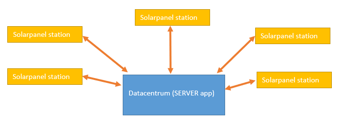
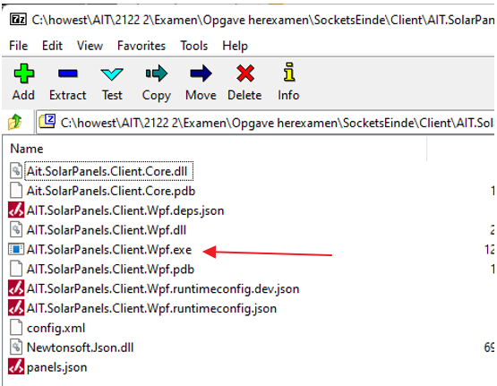
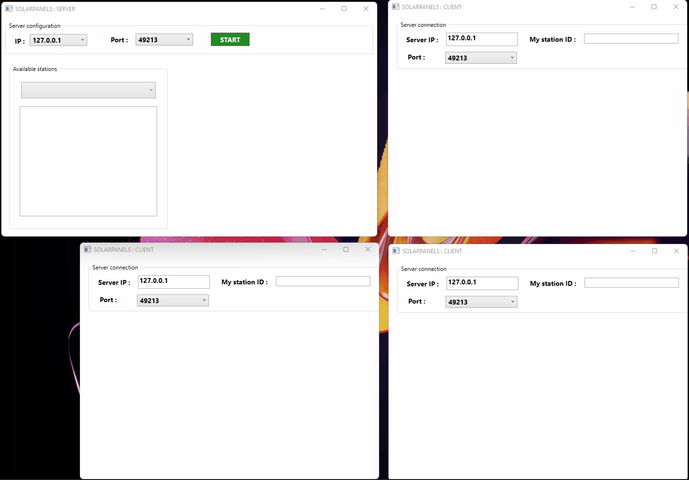

# Herexamen AIT  

## Algemeen  
In dit programma simuleren we een bedrijf dat verschillende zonnepaneelcentra beheert.  
Dus verspreid over het land zijn een aantal stations (Solarpanel Stations = de **clients**) waar verschillende zonnepanelen liggen en dus (bij zonlicht) energie opwekken.  
Elk van deze stations maakt verbinding met een centrale applicatie (= de **server**) waarbij telkens zowel de inventaris van de zonnepanelen wordt doorgestuurd maar eveneens de toestand van de zon in dat station (**sunconditions**).  
   
   
   
Op de server zelf kan de inventaris van de zonnepanelen per station worden geraadpleegd, de opbrengst uitgedrukt in KWH per station, maar ook alle verbonden stations samen (zie demo onderaan deze pagina).  
De CLIENT applicatie hoef je **NIET** te programmeren : deze is immers al door mij gemaakt.  
Je kan de uitvoerbare versie van de clientapplicatie hier downloaden (klik op "View raw" in het midden van het venster): het gaat om een ZIP bestand met daarin alle nodige bestanden om de client applicatie te laten draaien. Download het ZIP bestand en pak het uit. Het programma zelf kreeg de naam **Ait.SolarPanels.Client.Wpf.exe**  
  
    
  
*Dit ZIP bestand kan je eveneens terugvinden in de submap assets van de repo die je hier binnengehaald hebt.
Wanneer je straks in het server-gedeelte begint te programmeren kan je deze client versie (desnoods meerdere keren) opstarten en nakijken of alle communicatie wel naar wens verloopt.
De repo die je binnenhaalt is dus de SERVER APP
Ook hier is het grootste deel van de code al geschreven (zowel in de Class Library als in de code behind binnen je WPF).*  
  
Ter herinnering : we programmeren hier het SERVER gedeelte, te weten de software die draait in een **“Datacentrum”** die op bepaalde tijdstippen informatie van de diverse stations ontvangt.  
Zoals je straks gaat merken is alle code reeds aanwezig om de berichten die de server ontvangt te interpreteren en de centrale informatie bij te werken en bij te houden : dit hoef je dus zelf NIET te doen.  
  
## De opdracht  
  
Wat moet je dan zelf nog doen ?  
  
**Je dient enkel 2 methoden uit te werken in de code behind van het WPF project** *(het signatuur van deze methoden is ook al aanwezig en mag niet veranderd worden)*.  Deze methoden vind je helemaal onderaan je code behind terug…  
  * private void **StartListening()**  
  * private bool **HandleClientCall(Socket clientCall)**   
  
Let er ook op dat er helemaal bovenaan je code een aantal globale variabelen werden aangemaakt.  
Deze 2 globale variabele ga je straks in je code nodig hebben : maak dus bij voorkeur hiervoor geen nieuwe variabelen aan of wijzig hun naam niet.
  * **Socket mainSocket**  
  * **IPEndPoint mainEndPoint**  
  
In beide methoden is commentaar opgenomen dat min of meer overeenkomt met wat hieronder staat …  
  
### De methode StartListening()

In deze methode is het de bedoeling om de server app te beginnen laten “luisteren” naar eventuele binnenkomende berichten van clients.  
We gaan hier enkel “luisteren” : wanneer effectief een bericht binnenkomt, dan sturen we dat bericht meteen door naar onze volgende nog te maken methode (HandleClientCall, zie verder).  
  
In deze methode doe je volgende zaken :   
  * Je leest het geselecteerde IP nummer uit (cmbIps)  
  * Je leest het geselecteerde poortnummer uit (cmbPorts)  
  * Je maakt een IPEndPoint aan (gebruik hiervoor de globale variabele **mainEndPoint**)  
  * Je maakt een Socket aan (gebruik hiervoor de globale variabele **mainSocket**) waarmee je straks continu gaat “luisteren” naar eventueel binnenkomende berichten.  
  * Voorzie de nodige logica (denk aan – oneindige – lussen) om nu effectief te gaan “luisteren”.  Hou hierbij rekening met de globale variabele **serverOnline** die de waarde TRUE moet bevatten voor je gaat “luisteren”.  Zelf hoef je geen waarde toe te kennen aan deze variabele : dit wordt al gedaan in andere – reeds bestaande – methoden.  En zorg er uiteraard ook voor dat wanneer deze globale variabele de waarde FALSE bevat/krijgt, je uit eventuele lussen valt (zodat je programma weer verder kan).
  * Als een client een bericht verstuurt naar je server dan stuur je dat meteen door naar de methode **HandleClientCall** (in de vorm van een socket) (zie beschrijving hieronder).  
Deze methode zal dan het nodige doen om het bericht “uit te pakken”, het te (laten) interpreteren en (grafisch) de nodige acties zal ondernemen.
  
  
### De methode HandleClientCall(Socket clientCall)  
  
Deze methode zal enkel opgeroepen worden vanuit de methode **StartListening()** (zie hierboven).  
De methode ontvangt 1 parameter : een socket object waarin het bericht zit die door de client naar de server werd verstuurd.  
Denk er aan dat elk bericht dat door een client naar de server wordt verstuurd eindigt met het “end of message” symbool “#@@#”.  
**Opgelet** : je hebt dit symbool enkel nodig om te weten waar het bericht eindigt, **maar verwijder dit symbool zelf NIET !**  
  
Eenmaal je het bericht in stringformaat hebt stuur je het gewoon door naar de bestaande **solarPanelService.ProcessMessage(string message, out string stationId)** methode.
Je haalt zelf het bericht niet uit elkaar (je hoeft dus met andere woorden zelf de string niet te splitten) : deze **ProcessMessage** methode zal dat doen voor jou.
Wanneer je deze methode oproept dien je 2 argumenten mee te geven : 
  * Het eerste argument is het volledige bericht zelf in string formaat (dus inclusief alle eventuele delimiters)  
  * Het tweede argument is een output parameter van het type string.  De methode zal uit het bericht het ID van de client halen en dit tweede argument hiermee vullen zodat je hier weet om welke client het eigenlijk gaat.  
De methode retourneert een nullable boolean (bool?).  
  
Je dient deze retourwaard op te vangen en te bekijken :   
  * Is de retourwaarde null, dan   
    * stuurt de server NIETS naar de client terug  
    * roep je de bestaande methode **PopulateStations()** op (deze bevindt zich in je code behind)    
    * zorg je er voor dat geen enkel station geselecteerd staat in cmbStations  
  * Is de retourwaarde false, dan  
    * Stuurt de server de tekst “ERROR#@@#” terug naar de client  
    * Roep je de bestaande methode **PopulateStations()** op (deze bevindt zich in je code behind)  
    * Je kijkt na welke waarde in de outputparameter (tweede argument - *stationId*) zit :   
      * Is deze null, dan roep je de methode PopulateStations op en zorg je er voor dat geen enkel station geselecteerd staat in cmbStations  
      * Is deze NIET null, dan roep je de methode PopulateStations op en zorg je er voor dat in cmbStations dit station (client) geselecteerd staat en zorg je er meteen ook voor dat alle panelen van dat station in lstPanels getoond worden.  
  * Is de retourwaarde true, dan  
    * Stuurt de server de tekst “OK#@@#” terug naar de client  
    * Roep je de bestaande methode **PopulateStations()** op (deze bevindt zich in je code behind)    
    * Je kijkt na welke waarde in de outputparameter (tweede argument - *stationId*) zit :   
      * Is deze null (wat uiteraard onwaarschijnlijk is), dan roep je de methode PopulateStations op en zorg je er voor dat geen enkel station geselecteerd staat in cmbStations  
      * Is deze NIET null, dan roep je de methode PopulateStations op en zorg je er voor dat in cmbStations dit station (client) geselecteerd staat en zorg je er meteen ook voor dat alle panelen van dat station in lstPanels getoond worden.  
  
## Demo met 1 server en 3 solarpanel stations  
  

